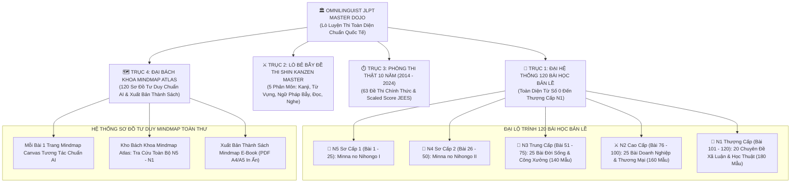

# 🏛️ HỒ SƠ KẾ HOẠCH CHIẾN LƯỢC: HỆ THỐNG LÒ LUYỆN THI JLPT TOÀN DIỆN (N3, N2, N1) & ĐẠI BẢN LỀ BÁCH KHOA 120 BÀI HỌC KÈM SƠ ĐỒ TƯ DUY MINDMAP TOÀN DIỆN

> **Mã dự án:** OMNILINGUIST-JLPT-DOJO-2026  
> **Ngày cập nhật & phê duyệt mở rộng:** 25/09/2026  
> **Trạng thái:** Đã phê duyệt chính thức — Đang triển khai thực thi toàn diện  
> **Phạm vi lưu trữ:** Lưu trữ cố định trong dự án (`docs/JLPT_MASTER_DOJO_STRATEGIC_PLAN.md`) — Tuyệt đối không ghi đè mất mát dữ liệu  
> **Nguyên tắc cốt lõi:** Tuyệt đối không dàn trải • Bám sát 100% giáo trình Shin Kanzen Master & Minna no Nihongo • Bao phủ 100% khung chương trình thi JLPT N5–N1 • Mỗi bài học 1 trang Sơ đồ tư duy Mindmap AI chuẩn mực • Khả năng xuất bản sách Mindmap E-Book độc lập

---

## 📌 1. Bối Cảnh, Đối Tượng Học Viên & Khảo Sát Tính Đầy Đủ Của Giáo Trình

### 1.1. Thực trạng & Đối tượng người học:
- **Người mới bắt đầu học tiếng Nhật**: Cần một điểm tựa chuẩn mực, không bị bơi trong biển kiến thức tự do, muốn học từ bài 1 một cách bài bản, dễ hiểu, có hệ thống cấu trúc rõ ràng.
- **Người lao động sang Nhật (Kỹ năng đặc định, Tu nghiệp sinh, Kỹ sư, người đi làm)**: Đa phần trước khi sang Nhật mới chỉ học được **Minna no Nihongo từ bài 1 đến bài 25 (N5)**, sau đó sang Nhật tự học "bồi", tích lũy giao tiếp thực tế ở công xưởng, quán xá nhưng **bị rỗng chân đế ngữ pháp N4 (Bài 26 đến bài 50)**.
- **Rào cản chết người khi lên N3, N2, N1**: Khi mở sách N3, học viên gặp ngay các cấu trúc liên quan mật thiết đến các thể biến đổi phức hợp của N4 (Bị động, Sai khiến, Bị động sai khiến, Cho nhận, Kính ngữ, Câu điều kiện). Nếu không có bài học bản lề mà nhảy ngay vào luyện đề, học viên sẽ bị ngợp, học vẹt, thi trượt nhiều lần.

### 1.2. Phân tích học thuật: Tại sao 12 – 15 bài học là chưa đủ?
Trong các giáo trình học thuật chuẩn mực tại Nhật Bản:
1. **Minna no Nihongo Chukyu I & II (Trung cấp)**: Gồm **24 bài học** (Chukyu I: 12 bài, Chukyu II: 12 bài, tương đương bài 51 – 74 nối tiếp 50 bài sơ cấp). Mỗi bài chứa 4–6 mẫu ngữ pháp lớn, đọc hiểu, đàm thoại công sở và bài tập.
2. **Shin Kanzen Master Bunpou**:
   - N3: Gồm 8 chương lớn nhưng chia thành **26 bài học nhỏ (Setsu)** với ~130–140 mẫu ngữ pháp và bẫy đề thi.
   - N2: Gồm 8 chương lớn nhưng chia thành **30 bài học nhỏ (Setsu)** với ~150–160 mẫu ngữ pháp doanh nghiệp.
   - N1: Gồm 8 chương lớn nhưng chia thành **35 bài học nhỏ (Setsu)** với ~180–200 mẫu ngữ pháp học thuật, xã luận.
3. **Nihongo Sou-Matome**: N3 chia làm 42 bài học (6 tuần x 7 ngày), N2 và N1 chia làm 56 bài học (8 tuần x 7 ngày).
4. **Mimikara Oboeru**: N3 có 110 mẫu, N2 có 110 mẫu, N1 có 117 mẫu chia theo các bài chuyên đề.

👉 **KẾT LUẬN CHIẾN LƯỢC:**  
Để đảm bảo **BAO PHỦ 100% TOÀN BỘ KHUNG CHƯƠNG TRÌNH HỌC VÀ CHƯƠNG TRÌNH THI**, OmniLinguist JLPT Master Dojo không gom tắt thành 12-15 bài ngắn ngủi, mà thiết lập **ĐẠI HỆ THỐNG 120 BÀI HỌC BẢN LỀ LIÊN TỤC (BÀI 1 ĐẾN 120)** kết hợp cùng **LÒ LUYỆN BẺ BẪY SHIN KANZEN MASTER**, **ĐẠI PHÒNG THI THẬT 10 NĂM** và **ĐẠI BÁCH KHOA SƠ ĐỒ TƯ DUY MINDMAP TOÀN THƯ (XUẤT BẢN THÀNH SÁCH)**.

---

## 🔍 2. Khảo Sát & So Sánh Học Thuật Các Bộ Giáo Trình

| Tiêu chí | **Shin Kanzen Master** | **Soumatome** | **TRY! JLPT** | **Mimikara Oboeru** | **Minna no Nihongo** |
| :--- | :--- | :--- | :--- | :--- | :--- |
| **Độ sâu ngữ pháp** | ⭐️⭐️⭐️⭐️⭐️ (Sâu nhất, chỉ rõ bẫy) | ⭐️⭐️ (Nông, dễ) | ⭐️⭐️⭐️⭐️ (Ngữ cảnh tốt) | ⭐️⭐️⭐️ (Ví dụ thực tế) | ⭐️⭐️⭐️⭐️⭐️ (Nền tảng chuẩn) |
| **Tỷ lệ đỗ JLPT thực tế** | **> 90%** (Vượt qua là đỗ cao) | ~50-60% (Dễ trượt đọc & bẫy) | ~70-75% | ~80% | ~85% (N5-N4) |
| **Độ khớp đề thi thật** | **Khớp 100% độ khó & dạng bẫy** | Dễ hơn đề thật 25% | Tương đương mức trung bình | Rất sát phần Nghe & Từ vựng | Cực sát nền tảng sơ cấp |
| **Kỹ năng Đọc hiểu** | **Số 1 tuyệt đối** (Dạy bóc tách câu) | Khá cơ bản | Đọc hội thoại | Không chuyên đọc | Đọc hiểu sơ cấp chuẩn |
| **Kỹ năng Nghe hiểu** | Sát đề thi | Ngắn | Nghe hội thoại | **Số 1 về Shadowing có Audio** | Nghe hội thoại mẫu |

👉 **Quyết định học thuật:**  
- **Khung bài học bản lề nền tảng**: Xây dựng **120 Bài học bản lề có Sơ đồ tư duy Tree Mindmap** theo cấu trúc ngữ cảnh của Minna no Nihongo (1-50) và Minna Chukyu + J-Business (51-120).
- **Lò luyện bẻ bẫy đề thi**: Dùng **Shin Kanzen Master** làm kim chỉ nam lý thuyết bẻ bẫy & đọc hiểu, kết hợp **Mimikara Oboeru** cho phản xạ âm thanh từ vựng / nghe hiểu.
- **Thao trường áp lực cao**: Đại phòng thi thật 10 năm (2014 - 2024).
- **Bản đồ trực quan ghi nhớ tối thượng**: Mỗi bài học 1 trang Sơ đồ tư duy Mindmap khoa học chuẩn đồ họa AI, liên hoàn 120 trang từ N5 đến N1, có thể xuất thành cuốn Sách Mindmap E-Book chuẩn in ấn.

---

## 🏛️ 3. Sơ Đồ Kiến Trúc Hệ Thống (Architecture Blueprint)

---

## 📚 4. Khung Chi Tiết Đại Lộ Trình 120 Bài Học Bản Lề (100% Syllabus)

Mỗi bài học trong 120 bài đều được trang bị:
1. **Chủ đề ngữ cảnh thực tế** (cuộc sống, công xưởng, văn phòng tại Nhật Bản).
2. **Trang Sơ đồ tư duy Mindmap chuyên biệt** xâu chuỗi bản chất các mẫu câu theo phân nhánh màu sắc logic.
3. **Công thức chia thể chuẩn xác** (`接続`).
4. **Sắc thái & Ngữ cảnh sử dụng** (`ニュアンス`).
5. **Ví dụ song ngữ Nhật - Việt kèm Audio phát âm**.
6. **Bộ câu hỏi trắc nghiệm phản xạ (Drill Quiz)** củng cố kiến thức ngay lập tức.

---

### 4.1. Cấp Độ N5: Sơ Cấp 1 (Bài 1 – 25 Minna no Nihongo) — [Đã Hoàn Thành]
- **Bài 1 – 5**: Đại từ nhân xưng, trợ từ `は, の, も`, đại từ chỉ định `これ, それ, あれ`, vị trí `ここ, そこ`, số đếm, thời gian, động từ di chuyển `いきます, きます, かえります`.
- **Bài 6 – 10**: Tha động từ trợ từ `を`, nơi chốn hành động `で`, rủ rê `ませんか, ましょう`, cho nhận vật phẩm `あげます, もらいます`, tính từ đuôi `い / な`, sự tồn tại `あります, います`.
- **Bài 11 – 15**: Lượng từ, so sánh hơn/nhất `より, ほうが, いちばん`, mong muốn `ほしい, たい`, mục đích `にいきます`, thể `て` (sai khiến nhẹ, đang làm `ています`), xin phép `てもいいですか`, cấm đoán `てはいけません`.
- **Bài 16 – 20**: Nối chuỗi hành động `てから`, nối tính từ, thể `ない` (xin đừng `ないでください`), bắt buộc `なければなりません`, không cần `なくてもいいです`, thể từ điển `辞書形` (có thể `ことができます`), sở thích `趣味は`, thể `た` (kinh nghiệm `たことがあります`, liệt kê `たり~たり`), thể thông thường `普通形`.
- **Bài 21 – 25**: Phán đoán `とおもいます`, trích dẫn `といいました`, bổ nghĩa mệnh đề danh từ, điều kiện `たら`, dù... nhưng `ても`.

---

### 4.2. Cấp Độ N4: Sơ Cấp 2 (Bài 26 – 50 Minna no Nihongo) — [Đã Hoàn Thành]
- **Bài 26 – 30 (Mở rộng diễn đạt & Tự/Tha động từ)**: `~んです` (giải thích lý do/mào đầu), thể Khả năng `可能形`, `~ながら` (vừa... vừa), `~し~し` (liệt kê lý do), Cặp tự-tha động từ `開く/開ける`, `~ています` (trạng thái tự nhiên) vs `~てあります` (trạng thái có chủ đích).
- **Bài 31 – 35 (Ý chí, Mệnh lệnh & Điều kiện)**: Thể Ý chí `意向形` (`~よう`), dự định `つもり`, `命令形・禁止形`, cách đọc biển báo quy định, thể điều kiện `~ば` (so sánh với `たら, と, なら`).
- **Bài 36 – 40 (Mục đích, Bị động & Trích dẫn)**: `~ようにする` (cố gắng làm), `~ようになる` (thay đổi trạng thái), Thể bị động `受身` (trực tiếp, gián tiếp, bị hại), danh từ hóa `~のは, ~のを, ~の'`, lý do `~て, ~で`.
- **Bài 41 – 45 (Cho nhận nâng cao & Phỏng đoán)**: `やる, くださる, いただく`, xin phép `~ていただけませんか`, phỏng đoán trực quan `~そうです` (trông có vẻ), phỏng đoán cảm tính `~ようです`, phỏng đoán suy luận `~らしい`.
- **Bài 46 – 50 (Sai khiến, Bị động sai khiến & Kính ngữ công sở)**:
  * Thể Sai khiến `使役` (ép buộc/cho phép).
  * **Thể Bị động sai khiến `使役受身` (bị bắt ép phải làm gì)**.
  * Tôn kính ngữ `尊敬語` & Khiêm nhường ngữ `謙譲語` chuẩn mực đời sống công sở Nhật.

---

### 4.3. Cấp Độ N3: Trung Cấp Nòng Cốt (Bài 51 – 75: 25 Bài Học Toàn Diện / 140 Mẫu Ngữ Pháp)

| Bài | Tên Bài Học & Chủ Đề Ngữ Cảnh | Các Mẫu Ngữ Pháp Cốt Lõi |
| :---: | :--- | :--- |
| **51** | Thời gian & Tranh thủ cơ hội (Đời sống Nhật) | `~うちに`, `~あいだ・あいだに`, `~最中に`, `~たびに` |
| **52** | Khởi đầu, Kết thúc & Tiến trình chuyển đổi | `~始める`, `~終わる`, `~続ける`, `~つつある`, `~だす` |
| **53** | Nguyên nhân trực tiếp & Hậu quả không mong muốn | `~ために`, `~せいで`, `~おかげで`, `~ばかりに`, `~ものだから` |
| **54** | Căn cứ phán đoán & Dấu hiệu nhận biết | `~ことから`, `~ところから`, `~によって`, `~につき` |
| **55** | Giới hạn phạm vi & Trường hợp ngoại lệ đặc biệt | `~かぎり`, `~かぎりは`, `~にかぎり`, `~にかぎって` |
| **56** | Gia tăng mức độ & Không chỉ dừng lại ở đó | `~だけでなく`, `~ばかりでなく`, `~にとどまらず`, `~はもちろん` |
| **57** | Tương phản hai mặt & Tính chất đối lập | `~にたいして`, `~はんめん (反面)`, `~いっぽうで (一方で)` |
| **58** | So sánh, Ưu tiên lựa chọn & Thà... còn hơn | `~くらいなら`, `~にくらべて`, `~というか~というか`, `~より` |
| **59** | Giả định có điều kiện & Miễn là thỏa mãn | `~さえ~ば`, `~かぎりは`, `~としたら`, `~とする` |
| **60** | Nghịch biện & Bất chấp sự thật diễn ra | `~のに`, `~くせに`, `~としても`, `~にしても`, `~にかかわらず` |
| **61** | Mục đích hướng đích & Kế hoạch tương lai | `~ように`, `~ために`, `~にむけて`, `~をめざして` |
| **62** | Phương tiện, Cầu nối trung gian & Nền tảng | `~によって`, `~をつうじて (を通じて)`, `~をとおして`, `~をもとに` |
| **63** | Trạng thái kéo dài & Tình huống giữ nguyên | `~たまま`, `~っぱなし`, `~きり`, `~ずにはいられない` |
| **64** | Cảm xúc bộc phát & Không thể kìm nén | `~てたまらない`, `~てしょうがない`, `~てならない`, `~ほしがる` |
| **65** | Lời khuyên chân thành, Đạo lý & Lẽ thường | `~べきだ / べきではない`, `~ことだ`, `~ものだ / ものではない` |
| **66** | Quy định cấm chỉ, Bắt buộc & Đành phải làm | `~てはならない`, `~ざるをえない`, `~わけにはいかない` |
| **67** | Dự đoán rủi ro, Nguy cơ & Khả năng tiêu cực | `~おそれがある`, `~かねない`, `~にちがいない`, `~かもしれない` |
| **68** | Bác bỏ hoàn toàn & Tuyệt đối không thể có chuyện | `~わけがない`, `~はずがない`, `~どころではない`, `~っこない` |
| **69** | Truyền đạt nguồn tin, Tin đồn & Lời kể lại | `~によると / によれば`, `~そうだ`, `~とのことだ / ということだ` |
| **70** | Hướng đến đối tượng & Tình cảm gửi gắm | `~にかんして`, `~について`, `~にたいして`, `~をこめて` |
| **71** | Đánh giá so với chuẩn mực & Bất ngờ trước thực tế | `~わりには`, `~にしては`, `~にこたえて`, `~をもとに` |
| **72** | Biến thiên tỷ lệ thuận & Hai vế cùng thay đổi | `~にしたがって`, `~につれて`, `~とともに`, `~にともなって` |
| **73** | Quyết định cá nhân, Tập thể & Thói quen duy trì | `~ことにする`, `~ことになる`, `~よう配慮する`, `~ように努める` |
| **74** | Kính ngữ trung cấp & Ứng xử đàm thoại nơi làm việc | `お・ご~いただく`, `~させていただけませんか`, `お目にかかる`, `存じる` |
| **75** | Đại Tổng Kết Bản Lề N3 & Bước Đệm Vững Chắc Lên N2 | Sơ đồ tư duy toàn cảnh 140 mẫu ngữ pháp N3 & Bảng phân biệt tương đồng |

---

### 4.4. Cấp Độ N2: Cao Cấp Thực Chiến Doanh Nghiệp (Bài 76 – 100: 25 Bài Học / 160 Mẫu Ngữ Pháp)

| Bài | Tên Bài Học & Chủ Đề Doanh Nghiệp | Các Mẫu Ngữ Pháp Cốt Lõi |
| :---: | :--- | :--- |
| **76** | Thời điểm tức thì & Tương quan chớp nhoáng | `~次第`, `~たとたん`, `~か~ないかのうちに`, `~やいなや` |
| **77** | Phạm vi không gian - thời gian & Quy mô bao phủ | `~をはじめ (として)`, `~から~にかけて`, `~にわたって`, `~を通じて` |
| **78** | Căn cứ pháp lý, Tiêu chuẩn & Đường lối chính sách | `~にもとづいて`, `~にそって`, `~のもとで`, `~に即して` |
| **79** | Nguyên nhân sâu xa, Động cơ & Sự quá đà | `~あまり`, `~あまりの~に`, `~ことだし`, `~わけだ`, `~ばかりに` |
| **80** | Thừa nhận một nửa, Nhượng bộ & Rào đón | `~ものの`, `~といっても`, `~からといって`, `~にしても` |
| **81** | Bất kể điều kiện, Đồng nhất tính chất mọi trường hợp | `~にしろ~にしろ`, `~にせよ`, `~を問わず`, `~にかかわらず` |
| **82** | Khẳng định đanh thép, Sự thật tất yếu khách quan | `~に相違ない`, `~に決まっている`, `~にほかならない`, `~にすぎない` |
| **83** | Phủ định kép & Nghĩa vụ đạo đức bắt buộc | `~ないではいられない`, `~ずにはすまない`, `~ざるを得ない` |
| **84** | Bác bỏ luận điểm, Phủ nhận khả năng xảy ra | `~どころか`, `~どころではない`, `~っこない`, `~わけがない` |
| **85** | Trăn trở từ chối & Năng lực bất khả kháng | `~かねる`, `~がたい`, `~ようがない`, `~かねない`, `~得ない` |
| **86** | Thời điểm bước ngoặt & Cơ hội chuyển mình | `~に際して`, `~にあたって`, `~を契機に`, `~を機に` |
| **87** | Tâm điểm tranh luận & Đối tượng định hướng | `~をめぐって`, `~に向けて`, `~を対象に`, `~にかかわる` |
| **88** | Sự biến thiên theo một chiều hướng xấu đi | `~一方だ`, `~ばかりだ`, `~つつある`, `~よりましだ` |
| **89** | Cảm xúc ngưỡng mộ, Biết ơn & Trân trọng sâu sắc | `~てやまない`, `~に堪えない`, `~を禁じ得ない`, `~に余る` |
| **90** | Đánh giá chủ quan & Lời cảnh báo thận trọng | `~ものがある`, `~とは限らない`, `~まい`, `~おそれがある` |
| **91** | Đạo lý xử thế, Quy phạm chuẩn mực xã hội | `~べきではない`, `~ことだ`, `~ものだ`, `~ものではない` |
| **92** | Nỗ lực đến cùng, Trạng thái phủ kín & Triệt để | `~ぬく`, `~きる / きれない`, `~かけ`, `~だらけ`, `~まみれ` |
| **93** | Biến thiên phức hợp tỷ lệ thuận trong quản trị | `~につれて`, `~にしたがって`, `~に伴って`, `~とともに` |
| **94** | Điều kiện tiên quyết & Giả định ngặt nghèo | `~とあれば`, `~としたら`, `~とすると`, `~ないことには` |
| **95** | Giả vờ, Cảm giác thoáng qua & Xu hướng tính cách | `~つもりで`, `~気味 (ぎみ)`, `~げ`, `~っぽい` |
| **96** | Đàm phán thương mại & Soạn thảo thư từ đối tác | Ngôn ngữ đàm phán hợp đồng, bảo lưu ý kiến, nhượng bộ có điều kiện |
| **97** | Báo cáo Hou-Ren-So & Thuyết trình chiến lược | Cấu trúc trình bày logic: Kết luận trước, Dẫn chứng sau |
| **98** | Kính ngữ ngoại giao, Xử lý khiếu nại khách hàng | Tạ lỗi trang trọng bậc cao, bảo vệ uy tín thương hiệu |
| **99** | Đọc hiểu tài liệu nội bộ, Thông cáo báo chí & Quy chế | Kỹ năng đọc quét nhanh văn bản doanh nghiệp Nhật |
| **100** | Đại Tổng Kết Bản Lề N2 (Bách Khoa Toàn Thư Doanh Nghiệp) | Hệ thống hóa 160 mẫu ngữ pháp & Bảng phân biệt cạm bẫy JLPT N2 |

---

### 4.5. Cấp Độ N1: Thượng Cấp Học Thuật & Xã Luận (Bài 101 – 120: 20 Chuyên Đề / 180 Mẫu Ngữ Pháp)

| Bài | Tên Chuyên Đề & Văn Phong Học Thuật | Các Mẫu Ngữ Pháp Cốt Lõi |
| :---: | :--- | :--- |
| **101** | Tương quan khoảnh khắc Thượng cấp (Tốc độ tức thời) | `~そばから`, `~が早いか`, `~や / ~や否や`, `~なり` |
| **102** | Khởi điểm lịch sử, Giới hạn tối thượng & Mốc thời gian | `~を皮切りに (して)`, `~を限りに`, `~をもって` |
| **103** | Tương tác đa chiều & Điều kiện tiên quyết tuyệt đối | `~と相まって`, `~なくして (は)`, `~なしに (は)`, `~たるもの` |
| **104** | Lý do trang trọng, Nguồn gốc học thuật & Tự trọng | `~ゆえに`, `~とあって`, `~手前`, `~にかまけて` |
| **105** | Bản sắc độc quyền, Giả định cực hạn & Ví von triết lý | `~ならでは (の)`, `~であれ`, `~ごとき / ごとく`, `~かのようだ` |
| **106** | Nghịch lý tư tưởng & Bất ngờ trước diễn biến thực tế | `~とはいえ`, `~と思いきや`, `~ものを`, `~とあれば` |
| **107** | Nhượng bộ tối cao & Quyết định bất di bất dịch | `~いかんにかかわらず`, `~いかんだ`, `~のいかんによらず` |
| **108** | Cấm chỉ văn bản công quyền & Không thể chấp nhận | `~べからず / べからざる`, `~まじき`, `~にたえない` |
| **109** | Tính tất yếu lịch sử, Cưỡng chế bắt buộc | `~ずにはおかない`, `~ないではおかない`, `~を余儀なくされる` |
| **110** | Trạng thái cùng cực đỉnh điểm & Cảm xúc tột cùng | `~極まる / 極まりない`, `~の極み`, `~の至り`, `~にたえない` |
| **111** | Tư cách tôn nghiêm, Danh dự & Bổn phận xã hội | `~たる者`, `~ともあろう者が`, `~に恥じない`, `~をおいて~ない` |
| **112** | Đánh giá học thuật, Xu hướng tiêu cực & Giới hạn việc làm | `~きらいがある`, `~までもない`, `~までだ / までのことだ` |
| **113** | Khả năng & Sự bất nhẫn tâm lý trong văn học | `~ようにも~ない`, `~に忍びない`, `~に耐える / 耐えない` |
| **114** | Hành động xen kẽ nhịp nhàng & Liệt kê trạng thái cực đoan | `~つ~つ`, `~なり~なり`, `~であれ~であれ`, `~といい~といい` |
| **115** | Xã luận Báo chí Asahi & Nikkei (Chính trị - Kinh tế) | Bóc tách cấu trúc câu đa tầng, văn phong nghị luận sắc bén |
| **116** | Ngôn ngữ Pháp luật, Hiến pháp & Văn kiện Nhà nước | Trật tự câu trang trọng cổ kính trong công văn chính thức |
| **117** | Văn học Cận đại Nhật Bản & Cổ ngữ còn lưu truyền | Các tàn tích ngữ pháp cổ (`~たまへ`, `~ずんば`, `~ならで`) |
| **118** | Ngoại giao quốc tế, Đàm phán đa phương & Diễn văn | Sắc thái trung lập, từ chối tế nhị cấp độ ngoại giao |
| **119** | Bẻ khóa Đọc hiểu Luận văn dài (Tư tưởng tác giả ẩn giấu) | Phương pháp truy vết các chỉ dấu quan điểm `~のではないか` |
| **120** | Đại Bách Khoa Toàn Thư Thượng Cấp N1 (Đỉnh Cao Bản Ngữ) | Tổng kết toàn bộ 180 mẫu ngữ pháp N1 & Sơ đồ phả hệ ngôn ngữ |

---

## 🗺️ 5. Đại Bách Khoa Sơ Đồ Tư Duy Mindmap Toàn Thư & Hệ Thống Xuất Bản Sách

Nhằm hiện thực hóa định hướng: *"Với mỗi một bài học, tạo thêm một trang tổng kết sơ đồ mindmap khoa học dễ nhớ nhất (theo chuẩn đồ họa AI chuyên nghiệp). Tổng hợp thành bộ sơ đồ mindmap liên hoàn N5 – N1 bản ngữ ưu việt nhất, có thể xuất riêng thành sách mindmap."*

### 5.1. Tiêu Chuẩn Thiết Kế Trang Sơ Đồ Tư Duy (Mindmap Canvas) Của Từng Bài Học:
Mỗi bài học trong số 120 bài được tích hợp chế độ xem **"🗺️ SƠ ĐỒ TƯ DUY TOÀN BÀI"** với đồ họa Infographic AI 4 tầng:
1. **Node Trung Tâm (Root Core)**:
   - Số thứ tự bài (`第〇課`), Tên bài song ngữ Nhật - Việt.
   - Trụ cột chuyên đề đời sống / doanh nghiệp / xã luận.
   - Thẻ định danh cấp độ (N5, N4, N3, N2, N1) có màu sắc nhận diện đặc trưng.
2. **Các Nhánh Cấp 1 (Primary Branches - Mẫu Ngữ Pháp Trọng Điểm)**:
   - Mỗi mẫu ngữ pháp là một nhánh lớn tỏa ra theo hình tia (Radial Mindmap) hoặc cây phân cấp (Tree Hierarchy).
   - Màu sắc phân tầng trực quan theo bảng màu AI hiện đại (Xanh Cyan, Lục Emerald, Vàng Hổ Phách Amber, Tím Violet, Đỏ Hồng Ruby).
3. **Các Nhánh Cấp 2 (Secondary Branches - Công Thức & Sắc Thái)**:
   - Công thức kết nối chuẩn (`接続`) viết cô đọng dạng toán học trực quan (`V-る / N-の + うちに`).
   - Sắc thái cảm xúc (`Ý chí / Vô ý chí`, `Tích cực / Tiêu cực`, `Ngữ cảnh công sở / Thường nhật`).
4. **Các Nhánh Cấp 3 (Leaf Nodes - Ví Dụ Vàng & Mẹo Nhớ Siêu Tốc)**:
   - Một ví dụ biểu tượng đắt giá nhất kèm phiên âm Furigana và bản dịch Việt.
   - **Mẹo nhớ AI (AI Mnemonic)**: Gợi ý liên tưởng hình ảnh hoặc công thức 3 giây để không bao giờ quên.
   - Nút **Audio phát âm** trực tiếp ngay trên từng nhánh của Mindmap.

### 5.2. Tính Năng Thao Tác Canvas Tương Tác:
- **Thu phóng mượt mà (Smooth Zoom & Pan)**: Phóng to xem chi tiết từng mẫu câu hoặc thu nhỏ để bao quát bức tranh tổng thể.
- **Thu gọn / Mở rộng nhánh (Collapsible Branches)**: Nhấp vào node để đóng/mở nhánh theo nhu cầu tự kiểm tra trí nhớ (Active Recall).
- **Chế độ Ban đêm (Dark Canvas) & Ban ngày (Light Paper)**: Thân thiện với mắt khi học đêm.

### 5.3. Kho Đại Bách Khoa Mindmap Atlas (Mindmap Hub) & Xuất Bản Thành Sách:
- **Mindmap Hub Độc Lập**:
  * Trang tổng hợp hiển thị toàn bộ 120 trang Sơ đồ tư duy liên hoàn từ N5 đến N1.
  * Bộ lọc nhanh theo Cấp độ (N5, N4, N3, N2, N1) và Nhóm chủ đề ngữ pháp (Thời gian, Nhân quả, Bị động/Sai khiến, Kính ngữ, Đàm phán kinh doanh, Xã luận báo chí...).
- **Bộ Công Cụ Xuất Bản Độc Lập (Exportable Atlas & E-Book Publishing)**:
  * **Xuất Trang Đơn Lẻ (Single Export)**: Nút `Xuất Ảnh HD (PNG / SVG)` 300 DPI để dán tại bàn làm việc hoặc `In Trực Tiếp (Print Page)`.
  * **Đóng Gói Thành Sách E-Book Mindmap Hoàn Chỉnh (Full Mindmap Book PDF)**:
    - Bìa sách nghệ thuật trang trọng: *"ĐẠI BÁCH KHOA SƠ ĐỒ TƯ DUY NGỮ PHÁP TIẾNG NHẬT TOÀN DIỆN N5 – N1 (THE MASTER JAPANESE MINDMAP ATLAS)"*.
    - Mục lục tương tác (Interactive TOC) dẫn đến 120 bài học.
    - 120 trang Mindmap chuẩn khổ A4 ngang (Landscape) in màu sắc nét.
    - Sẵn sàng xuất file PDF hoàn chỉnh để học viên in ra sách gáy xoắn mang theo ôn luyện, hoặc đọc trên iPad / máy đọc sách.

---

## ⚔️ 6. Trục Đối Trọng: Lò Luyện Bẻ Bẫy Shin Kanzen Master (Combat Dojo)

Nếu như **Trục 1 & Trục 4** cung cấp **chiều rộng nền tảng và sơ đồ tư duy**, thì **Trục 2 (Shin Kanzen Master)** cung cấp **chiều sâu thực chiến**, giúp học viên bẻ gãy mọi cạm bẫy trong đề thi trắc nghiệm JLPT:

1. **Kanji (Hán tự)**: Phân biệt các cặp chữ có bộ thủ gần giống nhau dễ gây nhầm lẫn (ví dụ: `微` vs `徴`, `博` vs `縛`), bảng âm On/Kun và các trường hợp đọc biến âm âm ngắt.
2. **Goi (Từ vựng)**: Luyện phản xạ âm thanh Shadowing theo phương pháp **Mimikara Oboeru Audio**, nắm vững quán dụng ngữ, từ láy tượng thanh tượng hình (`擬音語・擬態語`), và phó từ bẫy.
3. **Bunpou (Ngữ pháp bẻ bẫy)**:
   - Cung cấp **Bảng phân biệt A vs B vs C** mà đề thi chuyên mang ra để làm phương án nhiễu.
   - Huấn luyện kỹ thuật giải quyết **Mondai 2 (Dấu sao xếp câu)** bằng phương pháp ghép cặp ngữ pháp và cặp trợ từ logic.
   - Huấn luyện kỹ thuật giải quyết **Mondai 3 (Ngữ pháp trong đoạn văn)** bằng phương pháp bắt mạch liên từ nối.
4. **Dokkai (Đọc hiểu)**: Huấn luyện 5 kỹ năng vàng bóc tách đoạn văn:
   - Kỹ năng 1: Bắt đại từ chỉ định `これ, それ, あれ` và quy chiếu chủ ngữ ẩn.
   - Kỹ năng 2: Nhận diện câu chuyển ý (`しかし, だが, ところが`).
   - Kỹ năng 3: Bắt mạch quan điểm cốt lõi của tác giả (`~ではないだろうか, ~にちがいない, ~と思う`).
   - Kỹ năng 4: So sánh đối chiếu hai văn bản (Điểm đồng thuận & Điểm bất đồng).
   - Kỹ năng 5: Quét bảng biểu, tìm kiếm thông tin có điều kiện loại trừ trong 60 giây.
5. **Choukai (Nghe hiểu)**: 5 dạng bài đề thi thật chuẩn cấu trúc âm thanh Mimikara Audio (Hiểu nhiệm vụ, Hiểu ý chính, Phản xạ nhanh tức thì, Nghe tích hợp tổng hợp).

---

## ⏱️ 7. Trục Thao Trường: Đại Phòng Thi Thật 10 Năm (2014 – 2024)

- **Quy mô dữ liệu**: 63 bộ đề thi chính thức trọn vẹn (kỳ tháng 7 & tháng 12 hàng năm) của N3, N2, N1 từ năm 2014 đến 2024.
- **Mô phỏng áp lực phòng thi**:
  * Đồng hồ đếm ngược từng phần thi (Kiến thức ngôn ngữ + Đọc hiểu, Nghe hiểu).
  * Phiếu trả lời trắc nghiệm (Answer Sheet) có cờ đánh dấu câu chưa chắc chắn.
  * Tự động thu bài khi hết giờ.
- **Thuật toán tính điểm Scaled Score chuẩn JEES**:
  * Thang điểm 180, tính toán cân bằng độ khó.
  * Cảnh báo điểm liệt (<19/60 cho mỗi phần).
  * Đánh giá Pass/Fail: N3 (>= 95), N2 (>= 90), N1 (>= 100).
  * Báo cáo biểu đồ Radar chỉ rõ điểm mạnh, điểm yếu theo từng dạng Mondai.
  * Lời giải chi tiết song ngữ từng câu (Vì sao chọn 1, vì sao 2, 3, 4 sai).

---

## 🚀 8. Lộ Trình Triển Khai Kỹ Thuật

1. **Giai đoạn 1: Cơ sở dữ liệu ngữ liệu & Mindmap Layer (`src/data/curriculum/`)**:
   - `minna_master_50.json`: 50 bài Minna hoàn chỉnh (Bài 1 – 50) có sẵn dữ liệu Mindmap cấu trúc chuẩn [Đã xong].
   - `n3_foundation_lessons.json`: 25 bài học bản lề N3 (Bài 51 – 75) bao phủ 140 mẫu ngữ pháp, cấu trúc dữ liệu Mindmap đa nhánh, ngữ cảnh đàm thoại công xưởng.
   - `n2_foundation_lessons.json`: 25 bài học bản lề N2 (Bài 76 – 100) bao phủ 160 mẫu ngữ pháp doanh nghiệp, Mindmap thương mại J-Business.
   - `n1_foundation_lessons.json`: 20 chuyên đề bản lề N1 (Bài 101 – 120) bao phủ 180 mẫu ngữ pháp học thuật, Mindmap xã luận Asahi/Nikkei.
   - `shinkanzen_n3.json`, `shinkanzen_n2.json`, `shinkanzen_n1.json`: Lò luyện bẻ bẫy trắc nghiệm, đọc hiểu, nghe hiểu [Đã xong].
   - `jlpt_past_exams_10yr.json`: 63 đề thi thật 10 năm [Đã xong].

2. **Giai đoạn 2: Phát triển Component Trang Sơ Đồ Tư Duy Chuyên Biệt & Xuất Bản**:
   - Tạo component `MindmapCanvasModal.jsx` hoặc tích hợp trực tiếp vào bài học: Trình diễn sơ đồ tư duy dạng Radial/Tree trực quan với hiệu ứng màu sắc phân cấp AI, thu phóng, kéo rê, phát âm audio từng node.
   - Thêm nút `Xuất Ảnh Mindmap (PNG)` và `In Trang Mindmap (Print PDF)`.
   - Bổ sung Tab hoặc Modal **"🗺️ SÁCH MINDMAP TOÀN THƯ (N5 – N1)"** cho phép duyệt toàn bộ 120 sơ đồ tư duy và nút **"Xuất Bản Toàn Bộ Sách E-Book (Export Book)"**.

3. **Giai đoạn 3: Nâng cấp Giao diện Điều khiển Trung tâm (`src/JlptMasterDojo.jsx`)**:
   - Tích hợp công tắc chuyển đổi trực quan (Sub-mode Switch) trong từng Tab N3, N2, N1:
     * 📘 **Bài Học Bản Lề (Foundation Course)**: Danh sách bài học theo số thứ tự (51-75, 76-100, 101-120), Sơ đồ tư duy Tree Mindmap, ví dụ song ngữ, luyện tập phản xạ.
     * ⚔️ **Lò Luyện Shin Kanzen (Combat Dojo)**: Bảng bẻ khóa bẫy đề thi, kỹ thuật đọc hiểu, luyện nghe Choukai.
   - Thanh thống kê toàn cục: 120 Bài học bản lề • 120 Trang Sơ đồ tư duy AI • 480+ Bẫy Shinkanzen • 63 Đề thi 10 năm.

4. **Giai đoạn 4: Kiểm thử, Tối ưu & Đồng bộ**:
   - Kiểm tra tương thích PWA, tính năng Audio SpeechSynthesis.
   - Chạy kiểm tra chất lượng `npm run build` đảm bảo 100% không lỗi cú pháp.
   - Commit Git trên ổ `D:` và đồng bộ sang USB `G:`.

---
*Tài liệu được cập nhật và lưu trữ vĩnh viễn trong dự án tại `docs/JLPT_MASTER_DOJO_STRATEGIC_PLAN.md`.*
