# 🏛️ HỒ SƠ KẾ HOẠCH CHIẾN LƯỢC: HỆ THỐNG LÒ LUYỆN THI JLPT TOÀN DIỆN (N3, N2, N1) & BẢN LỀ QUỐC DÂN MINNA NO NIHONGO (BÀI 1 – 50)

> **Mã dự án:** OMNILINGUIST-JLPT-DOJO-2026  
> **Ngày phê duyệt & xuất bản:** 25/09/2026  
> **Trạng thái:** Đã phê duyệt chính thức — Đang triển khai thực thi  
> **Phạm vi lưu trữ:** Lưu trữ cố định trong dự án (`docs/JLPT_MASTER_DOJO_STRATEGIC_PLAN.md`)  
> **Nguyên tắc cốt lõi:** Tuyệt đối không dàn trải • Bám sát 100% giáo trình Shin Kanzen Master & Minna no Nihongo • Song ngữ Nhật - Việt rõ ràng • Đáp ứng người mới bắt đầu & người mất gốc

---

## 📌 1. Bối Cảnh, Đối Tượng Học Viên & Mục Tiêu

### 1.1. Thực trạng & Đối tượng người học:
- **Người mới bắt đầu học tiếng Nhật**: Cần một điểm tựa chuẩn mực, không bị bơi trong biển kiến thức tự do, muốn học từ bài 1 một cách bài bản, dễ hiểu, có hệ thống cấu trúc rõ ràng.
- **Người lao động sang Nhật (Kỹ năng đặc định, Tu nghiệp sinh, Kỹ sư, người đi làm)**: Đa phần trước khi sang Nhật mới chỉ học được **Minna no Nihongo từ bài 1 đến bài 25 (N5)**, sau đó sang Nhật tự học "bồi", tích lũy giao tiếp thực tế ở công xưởng, quán xá nhưng **bị rỗng chân đế ngữ pháp N4 (Bài 26 đến bài 50)**.
- **Rào cản chết người khi lên N3**: Khi mở sách N3, học viên gặp ngay các cấu trúc liên quan mật thiết đến các thể biến đổi phức hợp của N4 (Bị động, Sai khiến, Bị động sai khiến, Cho nhận, Kính ngữ, Câu điều kiện). Vì hổng chân đế nên họ hoang mang, học trước quên sau, thi trượt nhiều lần.

### 1.2. Mục tiêu chiến lược:
1. **Xây dựng Bản lề Vững chắc Tuyệt đối (Minna no Nihongo Toàn Diện 1 - 50)**:
   - Tập 1 (Bài 1 – 25): Đặt nền móng vững chắc cho người mới bắt đầu từ con số 0.
   - Tập 2 (Bài 26 – 50): Khóa cứu sinh cấp tốc lấp 100% lỗ hổng N4 cho người mất gốc và người đi làm.
2. **Luyện thi chuyên sâu N3, N2, N1 bám sát duy nhất giáo trình số 1 thế giới**:
   - Sử dụng **SHIN KANZEN MASTER (新完全マスター)** làm xương sống học thuật cho toàn bộ lý thuyết, bài tập bẻ khóa bẫy đề thi và kỹ năng đọc hiểu.
   - Kết hợp phương pháp âm thanh **MIMIKARA OBOERU (耳から覚える)** cho từ vựng và nghe hiểu (phù hợp người đi làm tranh thủ nghe khi đi tàu, làm việc).
3. **Phòng thi thật mô phỏng Tuyển tập Đề 10 Năm (2014 – 2024)**:
   - 20 kỳ thi chính thức (Tháng 7 & Tháng 12) cho N3, N2, N1.
   - Bấm giờ thi thật, phiếu trả lời trắc nghiệm chuẩn, tính điểm scaled score chuẩn hóa JEES và lời giải chi tiết song ngữ từng câu hỏi.

---

## 🔍 2. Khảo Sát & So Sánh Học Thuật Các Bộ Giáo Trình

Dựa trên khảo sát từ các viện ngôn ngữ, trung tâm tiếng Nhật tại Tokyo, Osaka, Hà Nội, TP.HCM và cộng đồng học thuật (`r/LearnJapanese`, JTEST, JLPT Forum):

| Tiêu chí | **Shin Kanzen Master** | **Soumatome** | **TRY! JLPT** | **Mimikara Oboeru** |
| :--- | :--- | :--- | :--- | :--- |
| **Độ sâu ngữ pháp** | ⭐️⭐️⭐️⭐️⭐️ (Sâu nhất, chỉ rõ bẫy) | ⭐️⭐️ (Nông, dễ) | ⭐️⭐️⭐️⭐️ (Ngữ cảnh tốt) | ⭐️⭐️⭐️ (Ví dụ thực tế) |
| **Tỷ lệ đỗ JLPT thực tế** | **> 90%** (Vượt qua sách này là đỗ điểm cao) | ~50-60% (Dễ trượt đọc hiểu & bẫy) | ~70-75% | ~80% |
| **Độ khớp đề thi thật** | **Khớp 100% độ khó & dạng bẫy** | Dễ hơn đề thi thật 20-30% | Tương đương mức trung bình | Rất sát phần Nghe & Từ vựng |
| **Kỹ năng Đọc hiểu** | **Số 1 tuyệt đối** (Dạy bóc tách cấu trúc câu) | Khá cơ bản | Đọc hội thoại | Không chuyên đọc |
| **Kỹ năng Nghe hiểu** | Sát đề thi | Ngắn | Nghe hội thoại | **Số 1 về Shadowing có Audio** |

👉 **Quyết định học thuật:** Chọn **SHIN KANZEN MASTER** làm kim chỉ nam lý thuyết & đọc hiểu, kết hợp **MIMIKARA OBOERU** cho phản xạ âm thanh từ vựng / nghe hiểu!

---

## 🏛️ 3. Sơ Đồ Kiến Trúc Hệ Thống (Architecture Blueprint)

```mermaid
graph TD
    Root["🏛️ OMNILINGUIST JLPT MASTER DOJO<br/>(Lò Luyện Thi Toàn Diện Chuẩn Quốc Tế)"]

    Hub0["🌱 PHÂN HỆ BẢN LỀ: MINNA NO NIHONGO (1 - 50)<br/>(Cơ sở vững chắc cho người mới & người mất gốc)"]
    Hub1["🥋 PHÂN HỆ N3: SHIN KANZEN MASTER N3<br/>(Trung cấp nòng cốt)"]
    Hub2["⚔️ PHÂN HỆ N2: SHIN KANZEN MASTER N2<br/>(Cao cấp thực chiến doanh nghiệp)"]
    Hub3["👑 PHÂN HỆ N1: SHIN KANZEN MASTER N1<br/>(Thượng cấp thành thạo bản ngữ)"]
    Hub4["⏱️ PHÒNG THI THẬT 10 NĂM (2014 - 2024)<br/>(Thi thử bấm giờ & Chấm điểm chuẩn hóa JEES)"]

    Root --> Hub0
    Root --> Hub1
    Root --> Hub2
    Root --> Hub3
    Root --> Hub4

    Hub0 --> M1["Tập 1: Bài 1 - 25 (Nền móng N5)"]
    Hub0 --> M2["Tập 2: Bài 26 - 50 (Bản lề N4)"]
    Hub0 --> M3["Sơ đồ tư duy phả hệ 7 thể động từ & Kính ngữ"]

    Hub1 --> K3["Kanji N3 (Chương 1-15: 650 chữ)"]
    Hub1 --> V3["Từ Vựng N3 (Chương 1-12: 3000 từ + Mimikara Audio)"]
    Hub1 --> G3["Ngữ Pháp N3 (8 Chương: 130 mẫu bẫy đề thi)"]
    Hub1 --> R3["Đọc Hiểu N3 (5 Kỹ năng bóc tách đoạn văn)"]
    Hub1 --> L3["Nghe Hiểu N3 (5 Dạng bài Mondai thi thật)"]

    Hub2 --> H2All["Đầy đủ 5 lĩnh vực N2 (Kanji, Từ vựng, Ngữ pháp, Đọc, Nghe)"]
    Hub3 --> H3All["Đầy đủ 5 lĩnh vực N1 (Kanji, Từ vựng, Ngữ pháp, Đọc, Nghe)"]

    Hub4 --> EX3["20 Đề thi thật N3 (Tháng 7 & 12 từ 2014-2024)"]
    Hub4 --> EX2["20 Đề thi thật N2 (Tháng 7 & 12 từ 2014-2024)"]
    Hub4 --> EX1["20 Đề thi thật N1 (Tháng 7 & 12 từ 2014-2024)"]
```

---

## 📚 4. Chi Tiết Nội Dung Từng Cấu Phần

### 4.1. Phân Hệ Bản Lề: Minna No Nihongo (Bài 1 – 50)
- **Tập 1 (Bài 1 – 25 / Chuẩn N5)**:
  * Bài 1 – 5: Đại từ nhân xưng, trợ từ `は, の, も`, đại từ chỉ định `これ, それ, あれ`, địa điểm `ここ, そこ`, số đếm, thời gian, động từ di chuyển `いきます, きます, かえります`.
  * Bài 6 – 10: Tha động từ trợ từ `を`, công cụ phương tiện `で`, rủ rê `ませんか, ましょう`, cho nhận vật phẩm `あげます, もらいます`, tính từ đuôi `い / な`, sự tồn tại `あります, います`.
  * Bài 11 – 15: Lượng từ, so sánh hơn/nhất `より, ほうが, いちばん`, mong muốn `ほしい, たい`, mục đích `にいきます`, thể `て` (sai khiến nhẹ, đang làm `ています`), xin phép `てもいいですか`, cấm đoán `てはいけません`.
  * Bài 16 – 20: Nối chuỗi hành động `てから`, nối tính từ, thể `ない` (xin đừng `ないでください`), bắt buộc `なければなりません`, không cần `なくてもいいです`, thể từ điển `辞書形` (có thể `ことができます`), sở thích `趣味は`, thể `た` (kinh nghiệm `たことがあります`, liệt kê `たり~たり`), thể thông thường `普通形`.
  * Bài 21 – 25: Phán đoán `とおもいます`, trích dẫn `といいました`, bổ nghĩa mệnh đề danh từ, điều kiện `たら`, dù... nhưng `ても`.

- **Tập 2 (Bài 26 – 50 / Chuẩn N4)**:
  * 6 Cụm Trụ Cột Cốt Tử:
    1. *Cụm 1: Mở rộng diễn đạt*: `~んです` (giải thích lý do/mào đầu), thể Khả năng `可能形`, `~ながら` (vừa... vừa), `~し~し` (liệt kê lý do).
    2. *Cụm 2: Tự động từ & Tha động từ*: Cặp tự-tha động từ `開く/開ける`, `~ています` (trạng thái tự nhiên) vs `~てあります` (trạng thái có chủ đích người làm), `~ておきます` (chuẩn bị sẵn).
    3. *Cụm 3: Thể Ý chí & Thể Mệnh lệnh/Cấm chỉ*: `意向形` (`~よう`), dự định `つもり`, `命令形・禁止形`, cách đọc biển báo quy định.
    4. *Cụm 4: Thể Bị động & Thể Sai khiến*: Thể bị động `受身` (trực tiếp, gián tiếp, bị hại), thể sai khiến `使役` (cho phép, ép buộc), và **Thể bị động sai khiến `使役受身`** (bị ép buộc phải làm).
    5. *Cụm 5: Chuỗi Cho - Nhận hành động*: `~てあげる, ~てもらう, ~てくれる` (Góc nhìn chủ thể hành động, chìa khóa mọi bài thi nghe N3/N2).
    6. *Cụm 6: Kính ngữ thực chiến công sở*: Tôn kính ngữ `尊敬語` (nâng người nghe lên) & Khiêm nhường ngữ `謙譲語` (hạ mình xuống), phân biệt `いらっしゃいます, おっしゃいます, なさいます, まいります, もうします, いたします`.

### 4.2. Phân Hệ Lò Luyện N3, N2, N1 Chuẩn Shin Kanzen Master
- **Cấu trúc 1 điểm ngữ pháp 5 lớp chuẩn Shinkanzen**:
  1. *Quy tắc nối câu (接続)*: V-thông thường, Danh từ + である/の, Tính từ đuôi な/い.
  2. *Ý nghĩa cốt lõi (意味)*: Dịch nghĩa song ngữ Nhật - Việt chuẩn xác, súc tích.
  3. *Sắc thái & Ràng buộc sử dụng (注意・ニュアンス)*: Chỉ rõ hành vi ý chí hay tự nhiên, tích cực hay tiêu cực, ngữ cảnh công sở hay khẩu ngữ.
  4. *Bảng bẻ khóa bẫy đề thi (使い分け・類似表現)*: So sánh trực diện các cấu trúc tương đồng mà đề thi hay lừa (ví dụ N3: `~うちに` vs `~あいだに`; N2: `~わけがない` vs `~はずがない`; N1: `~たるもの` vs `~ともあろうものが`).
  5. *Ví dụ thực tế song ngữ có Audio + Quiz củng cố 3 dạng Mondai*.

- **Đọc hiểu (Dokkai)**: Huấn luyện 5 dạng bài của Shinkanzen:
  1. Đoạn ngắn (短文 - Đọc thông báo, email, tìm ý chính).
  2. Đoạn trung (中文 - Nghị luận, tìm đại từ chỉ định `これ, それ, あれ` chỉ cái gì).
  3. Đoạn dài (長文 - Luận văn, quan điểm tác giả `のではないだろうか`).
  4. So sánh đối chiếu (統合理解 - Điểm chung & khác giữa 2 văn bản).
  5. Tìm kiếm thông tin (情報検索 - Quét poster, bảng giá, tờ rơi trong 60 giây).

- **Nghe hiểu (Choukai)**: 5 dạng bài đề thi thật chuẩn cấu trúc âm thanh Mimikara:
  1. Mondai 1: Hiểu nhiệm vụ (Cần làm gì tiếp theo).
  2. Mondai 2: Hiểu điểm cốt lõi (Nguyên nhân, lý do chọn).
  3. Mondai 3: Hiểu khái quát (Ý chính người nói).
  4. Mondai 4: Phản xạ tức thì (Hỏi 1 câu, đáp lại 1 câu).
  5. Mondai 5: Nghe tích hợp (Hội thoại dài, chọn phương án thích hợp nhất).

### 4.3. Phân Hệ Phòng Thi Thật 10 Năm (2014 – 2024)
- **Tuyển tập 20 kỳ thi chính thức**: Đầy đủ 2 đợt thi Tháng 7 và Tháng 12 hàng năm cho mỗi cấp độ N3, N2, N1.
- **Mô phỏng áp lực phòng thi**:
  * Đồng hồ đếm ngược từng phần thi (Kiến thức ngôn ngữ + Đọc hiểu, Nghe hiểu).
  * Phiếu trả lời trắc nghiệm (Answer Sheet) có cờ đánh dấu câu chưa chắc chắn.
  * Tự động thu bài khi hết giờ.
- **Thuật toán tính điểm Scaled Score**:
  * Thang điểm 180, tính toán cân bằng độ khó.
  * Cảnh báo điểm liệt (<19/60 cho mỗi phần).
  * Đánh giá Pass/Fail: N3 (>= 95), N2 (>= 90), N1 (>= 100).
  * Báo cáo biểu đồ Radar chỉ rõ điểm mạnh, điểm yếu theo từng dạng Mondai.
  * Lời giải chi tiết song ngữ từng câu (Vì sao chọn 1, vì sao 2, 3, 4 sai).

---

## 🚀 5. Lộ Trình Triển Khai Thực Thi

1. **Bước 1**: Xây dựng cấu trúc dữ liệu JSON chuẩn hóa trong `src/data/curriculum/`:
   - `minna_master_50.json` (Trọn vẹn 50 bài Minna no Nihongo).
   - `shinkanzen_n3.json`, `shinkanzen_n2.json`, `shinkanzen_n1.json` (Hệ thống chương mục chuẩn Shinkanzen).
   - `jlpt_past_exams_10yr.json` (Đại kho đề thi thật 10 năm).
2. **Bước 2**: Phát triển giao diện trung tâm Lò Luyện Thi `src/JlptMasterDojo.jsx` và các component con:
   - `MinnaCurriculumViewer.jsx` (Xem 50 bài Minna kèm Sơ đồ tư duy).
   - `ShinkanzenUnitViewer.jsx` (Xem bài học Shinkanzen 5 bước & bảng bẫy).
   - `ExamSimulatorModal.jsx` (Phòng thi thật toàn màn hình).
3. **Bước 3**: Cập nhật hệ thống điều hướng:
   - Đặt menu `JLPT 特訓道場 (Lò Luyện Shinkanzen)` tại `src/Sidebar.jsx`.
   - Khai báo route `/jlpt-dojo` trong `src/App.jsx`.
4. **Bước 4**: Kiểm thử, biên dịch PWA (`npm run build`) và đồng bộ sang USB G:.

---
*Tài liệu được ký duyệt lưu trữ vĩnh viễn trong dự án tại `docs/JLPT_MASTER_DOJO_STRATEGIC_PLAN.md`.*
